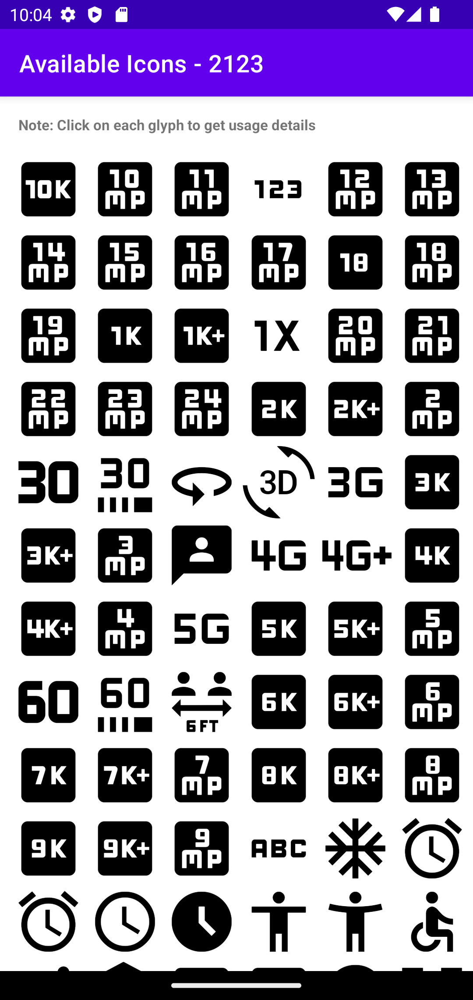

# Button Widget for Material Icons
`MaterialGlyphButton` widget can be used to render any of the [Material Icons](https://fonts.google.com/icons?icon.set=Material+Icons) 
from the embedded [Material Font](https://github.com/google/material-design-icons/tree/master/font). Currently there are 2100+ Icons to choose from.

## Usage
Currently the library is not available through any maven/gradle repositories (like mavencentral) since it's mainly meant for sample projects. At present, you can use this in couple of ways.
1. Easiest, build the project and copy the `.aar` file to your application's `libs` folder and update the gradle file to load from there.
2. Copy the glyphbutton directory to your project folder alongside the application module and add as module dependency. (If you do so, keep the Copyright and License file inside)

### In the code
```kotlin
val button: MaterrialGlyphButton = MaterialGlyphButton(...)
button.setGlyph(Glyph.ACCESSIBILITY)
```
### In the layout
```xml
<org.librecode.glyphbutton.widget.MaterialGlyphButton
    app:material_icon="accessibility" />
```
## Screenshots
### List of icons

### Details of selected icon
 

## License
This library is available as open source under Apache License, Version 2.0