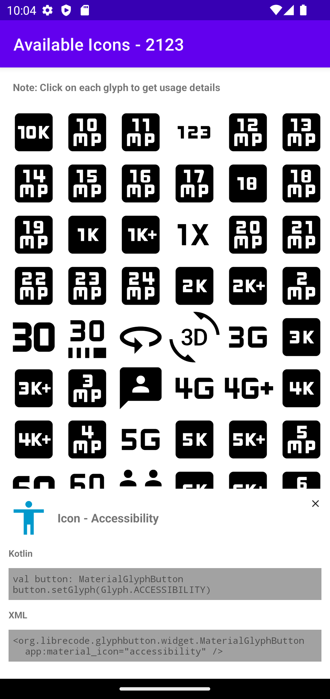

# Button Widget for Material Icons
`MaterialGlyphButton` widget can be used to render any of the [Material Icons](https://fonts.google.com/icons?icon.set=Material+Icons) 
from the embedded [Material Font](https://github.com/google/material-design-icons/tree/master/font). Currently there are 2100+ Icons to choose from.

## Usage
Currently the library is not available through any maven/gradle repositories (like mavencentral) since it's mainly meant for sample projects. At present, you can use this in couple of ways.
1. Easiest, build the project and copy the `.aar` file to your application's `libs` folder and update the gradle file to load from there.
2. Copy the glyphbutton directory to your project folder alongside the application module and add as module dependency. (If you do so, keep the Copyright and License file inside)

### In the code
```kotlin
val button: MaterrialGlyphButton = MaterialGlyphButton(...)
button.setGlyph(Glyph.ACCESSIBILITY)
```
### In the layout
```xml
<org.librecode.glyphbutton.widget.MaterialGlyphButton
    app:material_icon="accessibility" />
```

## Icon Help
Currently there are 2123 icons availabe in the bundled material font and all of the icons can be loaded on the widget. You can launch the `GlyphFinderActivity` included in the library to see a list of icons. Clicking each icons displays the usage details. Please see the screenshots below.

Each icon is using the same name as in the Material Fonts web page, All caps in the Enum and all small for attr name, with few exceptions.
1. The names starts with number is prefixed with `N_` since variable names cannot start with number
2. Names which are Java/Kotlin reserved words like `class` or `try` is postfixed with `_1`

## Screenshots
### List of icons

### Details of selected icon
 

## License
This library is available as open source under Apache License, Version 2.0